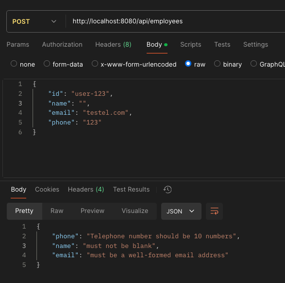

# General Validation in Spring Boot
- Spring Boot supports validation using `jakarta.validation` (formerly javax).
- Use annotations like `@Valid`, `@NotNull`, `@NotEmpty`, `@NotBlank`, etc.
- Add `@Valid` to method parameters or properties for automatic validation.
- Validation can be applied in both the model (global rules) and controller (endpoint-specific rules).


<!-- TOC -->
### Quick Links
  * [1. Common Validation Annotations](#1-common-validation-annotations)
  * [2. Applying Validation](#2-applying-validation)
    * [Best Practice:](#best-practice)
    * [In the Model](#in-the-model)
    * [In the Controller](#in-the-controller)
  * [3. Model-Level Validation in the Employee Entity](#3-model-level-validation-in-the-employee-entity)
  * [4. Handling Validation Errors](#4-handling-validation-errors)
  * [5. Global Exception Handling](#5-global-exception-handling)
    * [Benefits:](#benefits)
    * [Implementation:](#implementation)
    * [Example Output](#example-output)
  * [6. Custom Validations](#6-custom-validations)
<!-- TOC -->

---

## 1. Common Validation Annotations
- **@NotNull**: Ensures the value is not null.
- **@NotEmpty**: Ensures the value is not null and not empty (for strings or collections).
- **@NotBlank**: Ensures the value is not null, not empty, and not whitespace (strict for strings).
- **@Pattern**: Validates a string using a regex pattern.
- **@Size**: Validates the size of collections or the length of strings.
- **@Email**: Validates email format for strings.


## 2. Applying Validation

### Best Practice:
- Use validation in the **Model** for reusable, global rules.
- Use validation in the **Controller** for input validation specific to an endpoint.


### In the Model
- Use annotations directly on fields in the entity or DTO class.
- Ensures global consistency for the model.
  ```java
  @NotBlank
  private String name;
  ```
### In the Controller

- Use `@Valid` on method parameters to trigger validation.
- Use endpoint-specific constraints like `@Pattern` in controller methods.
  ```java
  public Employee getEmployeeByPhoneNumber(
      @Pattern(regexp = "^\\d{10}$") String phone) {
      ...
  }
    ```

## 3. Model-Level Validation in the Employee Entity
- The `Employee` model uses annotations from `jakarta.validation.constraints` for validation.
- Validations include:
    - **`@NotBlank`**: Ensures the field is not null, not empty, and not just whitespace.
    - **`@Size`**: Restricts the length of the `name` to 2-40 characters.
    - **`@Email`**: Validates the `email` field to be well-formed.
    - **`@Pattern`**: Ensures the `phone` field is a 10-digit number.

```java
@Document("Employees")
public record Employee(
    String id,
    @NotBlank @Size(min = 2, max = 40, message = "Name must contain between 2 to 40 characters") String name,
    @NotBlank @Email String email,
    @NotBlank @Pattern(regexp = "^\\d{10}$", message = "Telephone number should be 10 numbers") String phone
) {}
```

## 4. Handling Validation Errors
- Validation errors trigger a `MethodArgumentNotValidException`.
- To handle these errors, a **Global Exception Handler** intercepts them and returns meaningful responses.
- This avoids exposing unnecessary stack traces to the client.

## 5. Global Exception Handling

### Benefits:
- Centralized error handling reduces code duplication.
- Enhances API usability by providing clear error messages to clients.

### Implementation:

```java
@Override
protected ResponseEntity<Object> handleMethodArgumentNotValid(
    MethodArgumentNotValidException ex,
    HttpHeaders headers,
    HttpStatusCode status,
    WebRequest request) {
    Map<String, String> validationErrors = new HashMap<>();
    List<ObjectError> validErrors = ex.getBindingResult().getAllErrors();

    validErrors.forEach(error -> {
        String fieldName = ((FieldError) error).getField();
        String errorMessage = error.getDefaultMessage();
        validationErrors.put(fieldName, errorMessage);
    });

    return new ResponseEntity<>(validationErrors, HttpStatus.BAD_REQUEST);
}
```

### Example Output
When validation fails (e.g., invalid email or phone number), the API responds with a `400 Bad Request` status and a JSON object listing all the errors. For example:

**Request Body:**
```json
{
   "id": "user-123",
   "name": "",
   "email": "testel.com",
   "phone": "123"
}
```

**Response Body:**
```json
{
   "phone": "Telephone number should be 10 numbers",
   "name": "must not be blank",
   "email": "must be a well-formed email address"
}
```

**Postman Example:**




## 6. Custom Validations

- Spring allows creating custom validation annotations for complex requirements.
  ```java
  @Target({ ElementType.FIELD })
  @Retention(RetentionPolicy.RUNTIME)
  @Constraint(validatedBy = CustomValidator.class)
  public @interface CustomAnnotation {
      String message() default "Invalid value";
      Class<?>[] groups() default {};
      Class<? extends Payload>[] payload() default {};
  }
  ```

